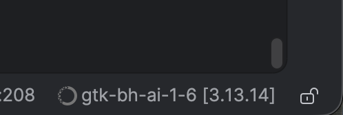

# Black Hat USA 2026 - Setup Guide

## Install Conda - Python Virtual Environment Manager

You can install either the full Anaconda application or a minimal version called [Miniconda](https://docs.anaconda.com/miniconda/).
Miniconda is a lightweight version of Anaconda that includes only the essential packages and tools. For the purpose of
this course, we recommend using Miniconda.

### Step 1: Download the Installer

Get the correct installer for your OS from the [Official Miniconda Download Page](https://www.anaconda.com/download/success).
Make sure to choose the right architecture (e.g., Apple Silicon vs. Intel for Mac).

### Step 2: Install by Operating System

#### **Windows**

1. Run the downloaded **.exe** file.
2. Follow the prompts.
   1. Install for "Just Me"
   2. **Leave "Add Miniconda3 to my PATH" unchecked** to prevent system conflicts.
   3. Check "Register Miniconda3 as my default Python."
3. Click **Install**.
* **To use:** Open the **Anaconda Prompt** from your Start Menu (do not use the standard Command Prompt).

* Be sure to accept the required agreements. Failure to do this will result in conda not running in PyCharm.

#### **macOS**

* **Graphical Installer (.pkg):** Double-click the file and follow the on-screen visual prompts.
* **Terminal Installer (.sh):** Open Terminal and run:  

```shell

  bash ~/Downloads/Miniconda3-latest-MacOSX-arm64.sh
  
```
  *(Change the filename to match your downloaded version).*

#### **Linux**

1. Open Terminal and run the installer script:

```shell

  bash Miniconda3-latest-Linux-x86_64.sh
  
```

2. Press **Enter** to read the license, then type yes to agree.

### Step 3: Finish and Verify (All Systems)

1. During the terminal installation (macOS/Linux), type **yes** when asked to run conda init. This links conda to your terminal.
2. **Close and reopen** your terminal or Anaconda Prompt.
3. Test the installation by running:

```shell

  conda --version
  
```

If successful, it will output the version number. macOS and Linux users will also see a (base) prefix next to their terminal prompt.

---

## PyCharm Professional & AI Setup Guide

### Important Prerequisites

⚠️ **Critical Note:** You **must** use **PyCharm Professional Edition** for this class. The free PyCharm Free/Community Edition
will not work because it lacks the ability to run Jupyter Notebooks. If you already have PyCharm Professional installed,
you can skip straight to Step 2.

### Step 1: Install PyCharm Professional (30-Day Free Trial)

1. Go to the official [JetBrains PyCharm Download page](https://www.jetbrains.com/pycharm/download/).
2. Select your operating system (Windows, macOS, or Linux) and download **PyCharm Professional**.
3. Run the installer and follow the setup prompts.
4. Launch PyCharm. When the license activation window appears, select Start Trial and log into (or create) your **JetBrains Account** to activate your 30-day trial.

### Step 2: Enable the JetBrains AI Assistant Plugin

1. Open PyCharm and open any existing project (or create a temporary new one) to get to the main interface.
2. Open your IDE settings:
    - **Windows/Linux:** Go to `File > Settings`
    - **macOS:** Go to `PyCharm > Settings`
3. On the left sidebar, click **Plugins**.
4. In the search bar at the top, type **AI Assistant**.
5. Find the **JetBrains AI Assistant** plugin and click **Install** (or **Enable** if it is already installed). Restart PyCharm if prompted.

### Step 3: Connect Your AI Provider (Bring Your Own Key)

To use the AI plugin without a paid JetBrains AI subscription, you must link it to your own **Anthropic, Gemini, or OpenAI**
developer account.

Agentive AI Agents
1. **Generate your API Key:** Log into your chosen provider's developer platform (e.g., OpenAI API Platform, Anthropic Console, or Google AI Studio) and create a new **Secret API Key/Access Token**. Copy it safely.
2. In PyCharm, navigate to: `Settings > Tools > AI Assistant > Providers & API keys`.
3. Locate the **Third-party AI providers** section and select your specific provider.
4. Paste your API Key into the designated field.
5. Click **Test Connection** to verify everything works, then click **Apply** and **OK**.

---

## Download the Course Material

The course materials are available on GitHub: [https://github.com/gtkcyber/applied_data_science_2026](https://github.com/gtkcyber/applied_data_science_2026)

You can either clone the repository or download it as a ZIP file.

### Option 1: Clone the Repository (Recommended)

If you have Git installed, we recommend cloning the repository. This makes it easier to pull updates if any changes are made to the course materials.

1. Open your terminal (or command prompt).
2. Navigate to the directory where you want to store the course files.
3. Run the following command:

```bash
git clone https://github.com/gtkcyber/applied_data_science_2026.git
```

### Option 2: Download as a ZIP File

If you don't have Git installed, you can download the files manually:

1. Visit the [GitHub repository page](https://github.com/gtkcyber/ai_cyber_bootcamp_2026).
2. Click the green **Code** button near the top right.
3. Select **Download ZIP**.
4. Once the download is complete, extract the ZIP file to a folder on your computer.

---

## Setup the Course Environment

Follow these steps to configure your coding environment for the bootcamp.

### Step 1: Open the Project in PyCharm

1. Launch **PyCharm Professional**.
2. On the Welcome screen, click **Open** (or go to `File > Open`).
3. Navigate to the directory where you cloned or downloaded the course repository.
4. Select the project folder and click **Open**.

### Step 2: Create the Conda Environment

We use a configuration file called `environment-1-7.yml` to ensure everyone has the same versions of the necessary libraries.

1. Open the **Terminal** at the bottom of the PyCharm window.
2. Ensure you are in the project root directory (where `environment-1-7.yml` is located).
3. Run the following command to create the virtual environment:

```shell
conda env create -f environment-1-7.yml
```

*Note: This process may take a few minutes as it downloads and installs all dependencies.*

### Step 3: Configure the Project Interpreter

Once the environment is created, you must tell PyCharm to use it for this project.

1. Open your IDE settings:
    - **Windows/Linux:** `File > Settings`
    - **macOS:** `PyCharm > Settings`
2. Navigate to **Python > Interpreter**.
3. Click the **Add Interpreter** button and select **Add Local Interpreter...**.
5. Select the **Use existing environment** radio button.
6. In the Type dropdown, select **Conda**.
6. In the Environment dropdown list, locate the environment you just created (it will be named `gtk-bh-ads-1-7`). If you don't see it, click the **reload environments** link.
7. Click **OK** to save the interpreter settings, then **OK** again to close the Settings window.

PyCharm will now begin indexing your environment, after which you will be ready to start the course!

You will see the environment selected in the lower right corner of PyCharm.



---

## Additional Conda environments

You can come back here later and add the remaining environments:

```shell
conda env create -f environment-5_4.yml
```

```shell
conda env create -f environment-6_2.yml
```

```shell
conda env create -f environment-8-10.yml
```

---

## Troubleshooting

If you are having problems with lab 5.4 you may need to install XGBoost.

XGBoost (a TPOT dependency) needs `libomp` or importing it fails. Install it once:

```shell
brew install libomp
```
